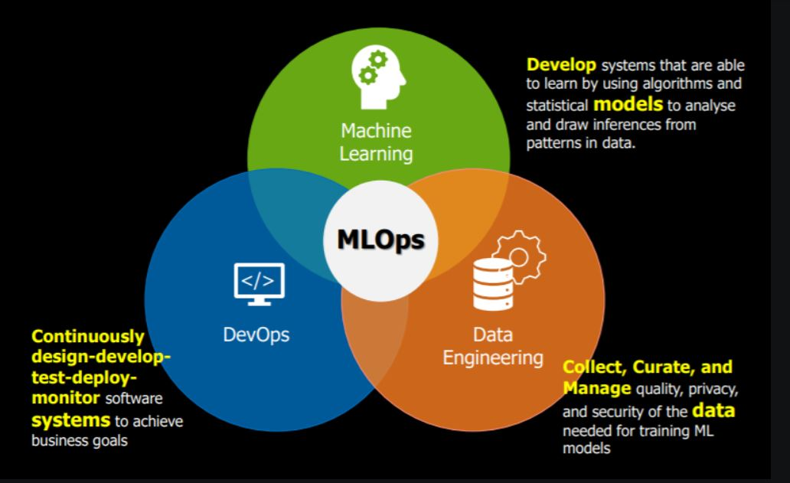
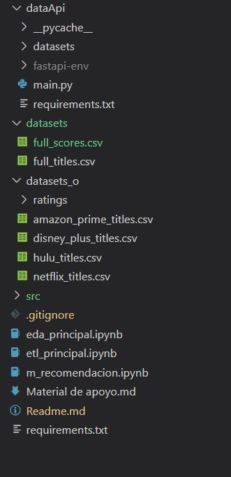

>

# <h1 align=center> **PROYECTO INDIVIDUAL Nº1**</h1>

## **Machine Learning Operations (MLOps)** 
## **Henry's Labs**
### *Por Christian Lucero (DTS-08)*

## **ESTRUCTURA DEL PROYECTO** :white_circle:

A continuación podrá visualizarse el proyecto finalizado con su estructura de archivos y carpetas

Los principales archivos desarrollados (que en el apartado siguiente se describirán en forma detallada y precisa su contenido, son:
- etl_principal.ipynb
- eda_principal.ipynb
- m_recomndacion.ipynb
- main.py

## **DESARROLLO DE LA SOLUCIÓN (PROYECTO)** :white_circle:

### **1. Etapa del proceso ETL** :arrow_right:

Archivo principal: **[etl_principal.ipynb](etl_principal.ipynb)**
- Se realizó el proceso de ETL (extracción, transformación y carga).
- Se prepararon los dataframe necesarios para el proceso, producto del tratamiento de los cuatro dataset provistos (amazon_prime_titles.csv, disney_plus_titles.csv, hulu_titles.csv, netflix_titles.csv) de películas y series (títulos).
- Se preparó un dataframe único para el tratamiento de los ocho datasets provistos con información sobre los ratings.
- Se realizaron las tareas de MVP (producto mínimo viable) requeridas:
    1. Generar campo id con la primera letra del nombre de la plataforma, seguido del show_id ya presente en los datasets.
    2. Se reemplazaron los valores nulos del campo 'rating' por el string "G"
    3. Se establecieron los campos con fechas con el formato AAAA-mm-dd
    4. Todos los campos de texto se convirtieron en minúsculas.
    5. Se dividió (split) el campo 'duration' en dos campos: 'duration_int' (tipo integer) y 'duration_type' (tipo string)

### **2. Etapa de desarrollo API** :arrow_right:

Archivo principal: **[main.py](dataApi/main.py)**
- Se realizó el proceso de disponibilización de la información mediante el framework FastAPI.
- Se utilizó la nube Render para efectuar el deploy del proyecto.

    **[Acceso a la documentación en render.com](https://pi-ml-ops-n120.onrender.com/docs)** desde donde podrás acceder a todas las consultas desarrolladas.
- Se realizaron las consultas (funciones) de MVP requeridas:
    1. Función **get_max_duration**: película con mayor duración con filtros opciones de Año, Plataforma y Tipo de Duración.

        [Link ejemplo Funcion 1](https://pi-ml-ops-n120.onrender.com/max_duration?year=2018&platform=netflix&duration_type=min)

    2. Función **get_score_count**: cantidad de películas por plataforma con un puntaje mayor a determinado número (de 1 a 5) en determinado año.

        [Link ejemplo Función 2](https://pi-ml-ops-n120.onrender.com/score_count/hulu/3.0/2020)

    3. Función **get_count_platform**: cantidad de películas por plataforma con filtro de Plataforma.

        [Link ejemplo Función 3](https://pi-ml-ops-n120.onrender.com/count_platform/amazon)

    4. Función **get_actor**: actor que se repite más veces según plataforma y año.

        [Link ejemplo Función 4](https://pi-ml-ops-n120.onrender.com/actor?platform=disney&release_year=2010)

### **3. Etapa del proceso EDA** :arrow_right:
Archivo principal: **[eda_principal](eda_principal.ipynb)**
- Se realizaron las tareas de MVP requeridas:
    1. Se analizaron los dataframes (títulos y scores/ratings) en su estructura, forma, información, valores nulos, valores duplicados, etc.
    2. Se utilizó Pandas Profile Report para efectuar un análisis más profundo del archivo de títulos (películas y series).
    3. Se realizó un histograma con Matplotlib y Seaborn para obtener una visión general de distribución de los datos del dataframe de películas y series.

### **4. Etapa del Sistema de Recomendación** :arrow_right:
Archivo principal: **[m_recomendacion.ipynb](m_recomendacion.ipynb)**
- Para lograr el MVP de esta etapa, se utilizó la librería **Surprise**, basados en el algoritmo **SVD**

## **FUENTE DE DATOS** :white_circle:

+ **[Dataset](https://drive.google.com/drive/folders/1b49OVFJpjPPA1noRBBi1hSmMThXmNzxn)**: La carpeta 'ratings' tiene varios archivos con las reseñas de los usuarios, la carpeta raíz tiene un dataset por proveedor de servicios de streaming.
 

## **MATERIAL DE APOYO** :white_circle:

En este mismo repositorio podras encontrar algunos **[links de ayuda](https://github.com/HX-PRomero/PI_ML_OPS/blob/main/Material%20de%20apoyo.md)**. Recuerda que no son los unicos recursos que puedes utilizar!
 

